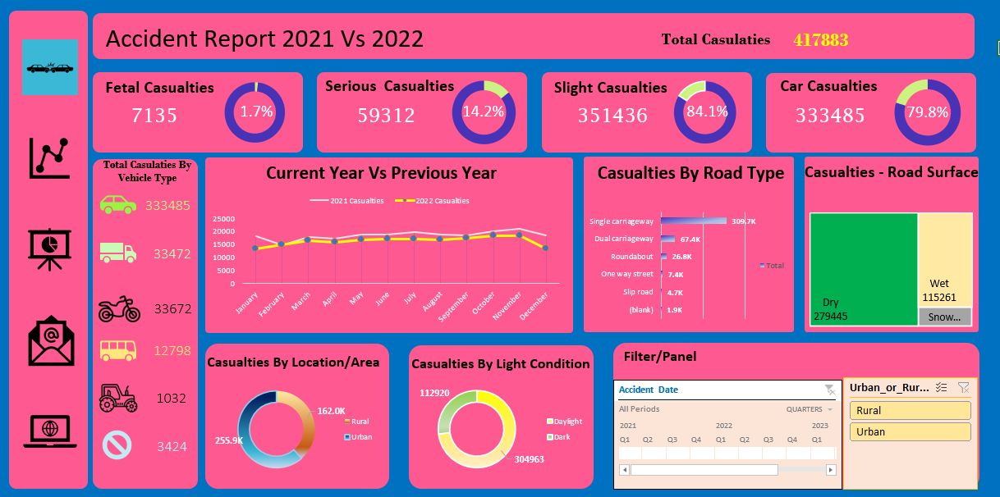

# Accident_Analysis_Excel_Dashboard
Road accident analysis dashboard using Excel (2021 vs 2022)

## Tools Used
- Microsoft Excel
- Pivot Tables
- Pivot Charts
- Slicers
- Excel Formulas

## Key Insights
- Slight casualties are the highest 
- Car-related accidents dominate
- Urban areas report more accidents than rural
- Single carriageways have the most accidents

## Dashboard Preview

## Created By
Lakshmi | Aspiring Data Analyst
